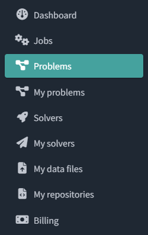
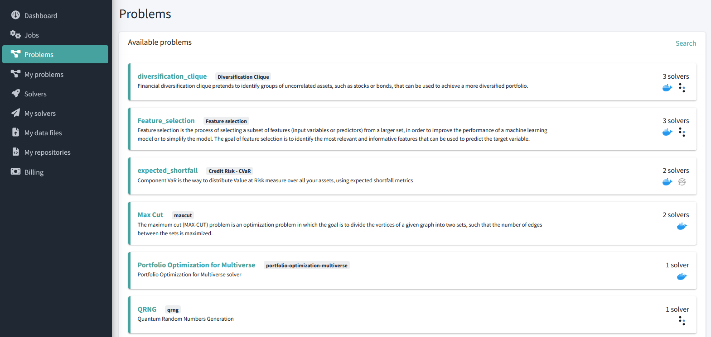

# Navigate through the problems

The **Problems** section shows all the Use Cases currently available on the platform.

You can access this section from the navigation menu on the left side.

You will also see the **My problems** section that shows those problems that were added by you to the platform.

The Problems section, will show all the problems available as shown below:

Along with each problem, you will see the number of solvers available for it and the icons of the hardware providers used by those solvers.

You can click on any of the problems to access its details page, where you will see the following information:

* The problem **datailed description**
    * Business description
    * Scientific approach
    * Technical details
* **API information**
* The list of **solvers** available for this problem
* **Execute problem** section. More information on how to execute a problem in [this page](launch-job-dashboard.md).
* The list of the **latest executions** of this problem

## What's next

:octicons-chevron-right-12: [Execute a problem](launch-job-dashboard.md)

:octicons-chevron-right-12: [Upload a data file](upload-data-file.md)
